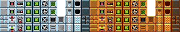

Simples Pimples Kit
===================

Inspired by the wonderful [Simples Pimples](http://opengameart.org/content/simple-broad-purpose-tileset) spritesheet, I decided to create a public domain jumpstart for building HTML5 games using this spritesheet and the [Phaser](http://phaser.io) library.

To make the spritesheet easier to work with, I took the liberty of splitting it up into categories.

Categories
----------

| Name | Image |
| ---- | ----- |
| Bombs |  |
| Bottles |  |
| Boulders |  |
| Bricks |  |
| Cans |  |
| Cartons |  |
| Caves |  |
| Characters |  |
| Cheese |  |
| Chests |  |
| Columns |  |
| Control Panels |  |
| Doors |  |
| Drinks |  |
| Drops |  |
| Drugs |  |
| Foliage |  |
| Fruits & Vegetables |  |
| Ladders |  |
| Lakes |  |
| Lock & Keys |  |
| Meat |  |
| Meds |  |
| Metal Blocks |  |
| Pavers |  |
| Pinball |  |
| Sandwiches |  |
| Sign Posts |  |
| Skulls |  |
| Stones |  |
| Sweets |  |
| Torches |  |
| Treasure |  |
| Warning Blocks |  |
